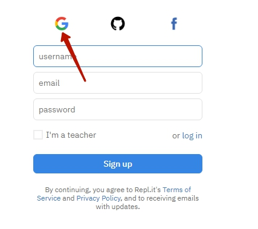
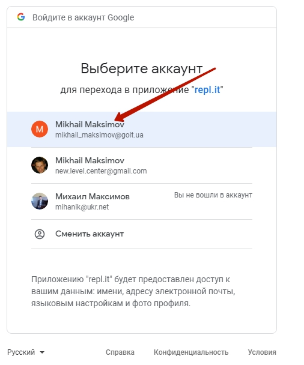
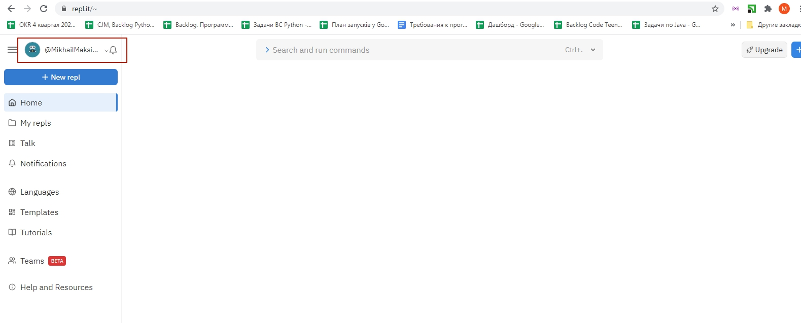
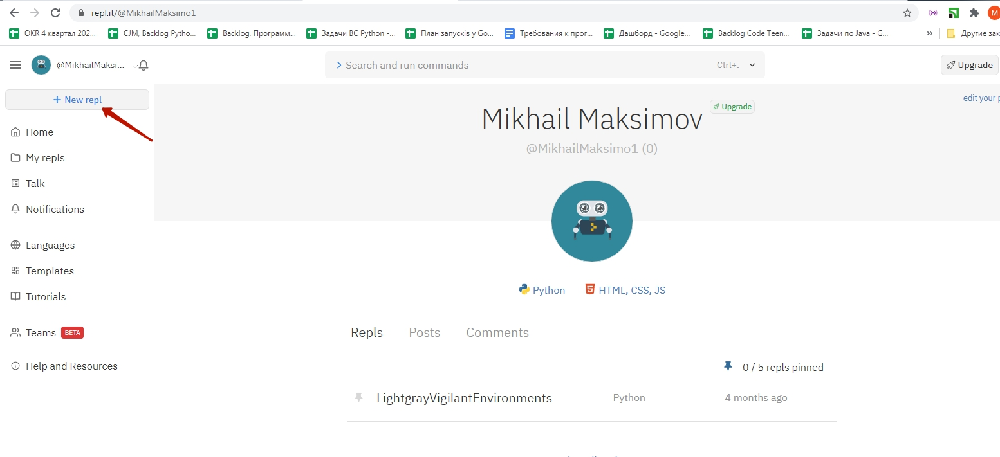
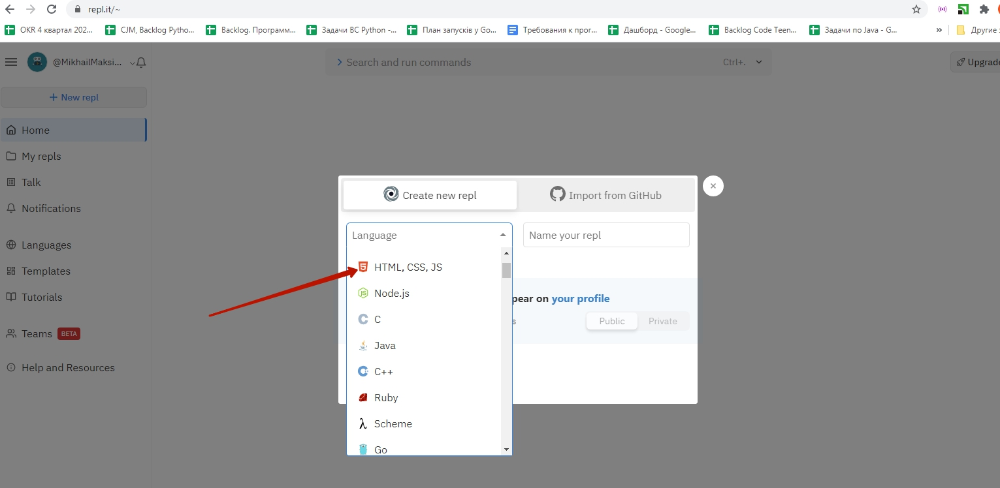
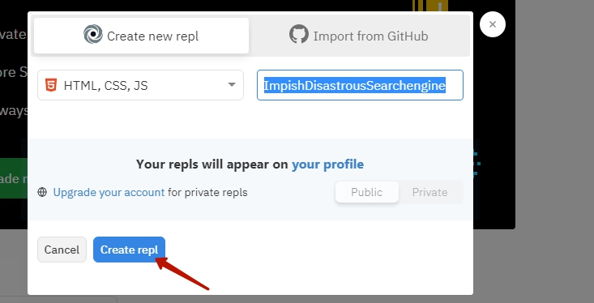
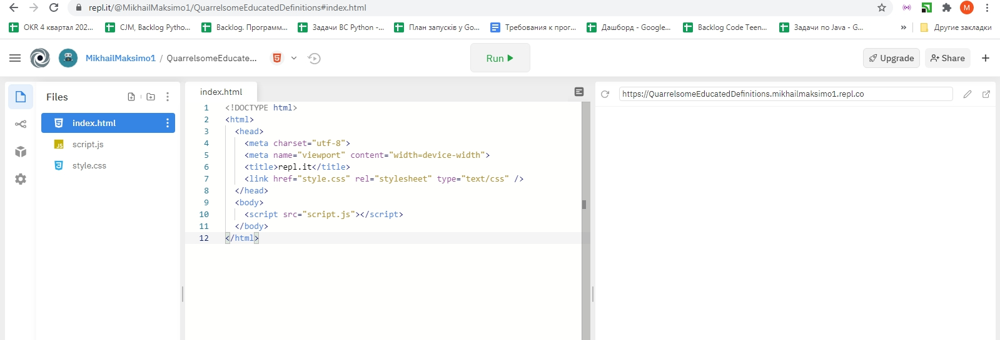

# Підготовка до пробного заняття з курсу FrontEnd (створення сайтів)
Заняття відбудеться 23 січня о 11:00.
Протягом заняття разом із викладачем Ви познайомитеся з сучасними технологіями створення сайтів та спробуєте працювати з ними самостійно.

Для роботи на пробному занятті ми просимо вас заздалегідь зареєструватися на безкоштовному сервісі <a href = "https://repl.it/" target = _blank>https://repl.it/</a>.

## Реєстрація на сервісі https://repl.it/

   

Заходимо на сервіс <a href = "https://repl.it/" target = _blank>https://repl.it/</a> (п.1.) та натискаємо кнопку "Start coding" (п.2.).   
   
  

У відкритому вікні обираємо реєстрацію за допомогою сервісу Google.  

  

Обираємо ваш акаунт

  

Після успішної авторизації ви побачите свій акаунт у https://repl.it/

  

Для відкриття потрібного інтерфейсу для заняття нажміть `new repl`

  

У вікні, що з'явиться оберіть пункт `HTML, CSS, JS`

  

Та нажміть на кнопку `Create repl`

  

Перед Вами з'явить налаштовані вікна.

