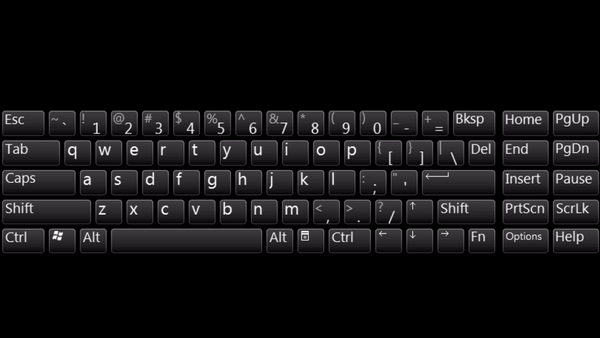

# Підготовка  до пробного заняття.
Для того, щоб заняття для вас пройшло **максимально ефективно** просимо вас:
1. Зареєструватися на ресурсі <a href = "https://repl.it/">Repl.it</a> (<a href = "https://github.com/mikh-maksi/frontend-probe">посилання на інструкцію з реєстрації</a>).

2. Розібратися із комбінаціями горячих клавіш:
* CTRL+C - при виділенні тексту - копією його

* CTRL+V - вставляє скопійований текст

 